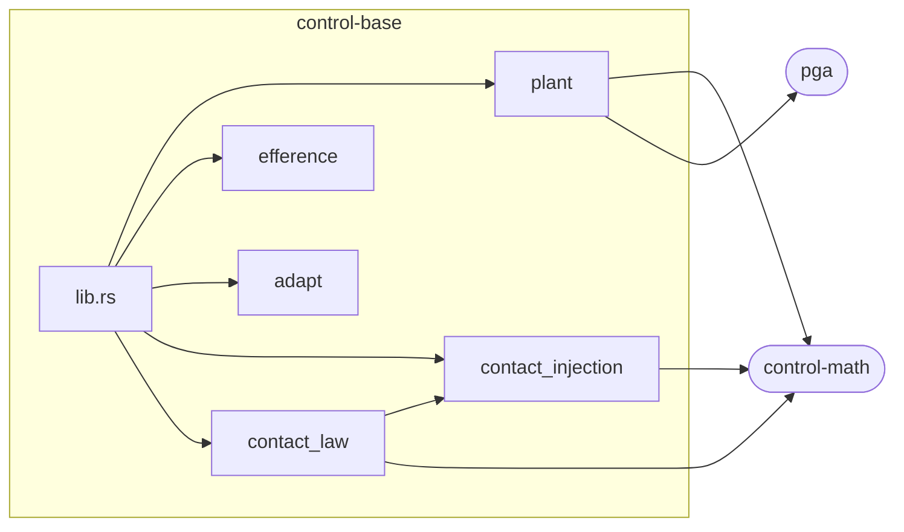

# control-base

控制栈中与产品无关的基础层:**Plant 契约(trait)、共享接触模型与 Efference 传出副本**。本 crate 只定义接口和值类型,不包含任何引擎、模型或具体机器人。

## 核心设计意图

**契约必须与实现分离。** 一份写在实现旁边的契约,随时可能被实现反向渗透;一个被多方持有的值类型,不能住在任何一方之下。因此 control-base 用"它允许引用什么"来定义自己:只允许引用自己的类型和下方的算术 crate(`control-math` 与 `pga`),不引用任何引擎、模型或具体的 plant 实现。这样后端可以被整体替换,而接口对此一无所知。

五个模块各司其职:

| 模块 | 职责 | 设计要点 |
| --- | --- | --- |
| `plant` | Plant 契约:结构声明(`PlantStructure`)、状态读取、运动学、动力学、指令实现化(`realize_command`);以及 PGA motor 的位姿表达与四元数/rotor 换算 | 位姿以单个 PGA motor `T(p) R` 交付,而非 (位置, 四元数) 对——后者是仿射的,前者一次乘法即可复合;任务可以是坐标系(6 行)也可以是点(3 行无旋转),以数据(`TaskMap`)声明而非靠命名约定 |
| `efference` | 指令/实测对及其残差(`measured - commanded`) | 比较是无条件的算术:哪些读数重要是策略问题,算术不回答;残差即"读数中不是机器自己所为"的部分 |
| `contact_injection` | 一个已决定的接触力对机器**做什么**:一阶滤波、门限(`live`)、限幅、逐点经 Jacobian 行注入广义力,以及库仑摩擦行与扭转摩擦行 | 门限、先限幅后阻尼的顺序、阻尼的符号,是第二份拷贝最容易悄悄写错的地方,所以只此一份 |
| `contact_law` | 接触力**从何而来**,作为可替换策略(`ContactLaw` trait):`ReportContact`(信任世界回报)、`PenaltyContact`(本方几何罚力)、`FlooredContact`(两者取大)、`SolveContact`(对动力学解 LCP 乘子) | 策略只见"已经算好的数字"——不见引擎、不见句柄、不做 FK,因此力源可以整体替换而其余接触模型不变 |
| `adapt` | 误差驱动的在线标定:`Adapt`(带限幅、速率、运行均值、采样纪律审计与延迟信用 `learn_at`)与 `LeadTrim`(只学前馈增益的比例,不学形状) | 误差必须**带符号定向**地到达(增大 trim 必须减小误差)——符号方向此处不可知,猜一个等于内建某台机器的约定 |

## 模块依赖拓扑

crate 内只有一条内部依赖边(`contact_law` 复用 `ContactInjection` 的门限与限幅,避免同一份机制抄两遍),依赖图是无环的:



## 信号流

```mermaid
flowchart LR
    subgraph 调用方[调用方:控制环路]
        CTRL[控制器]
    end
    subgraph 本crate[control-base:契约与值类型]
        STRUCT[Plant::structure<br/>结构声明]
        READ[状态/运动学/动力学读取<br/>joint_positions · frame_motor<br/>mass_matrix · jacobians]
        REALIZE[Plant::realize_command<br/>广义力 → 执行器指令]
        LAW[ContactLaw::decide_into<br/>决定每个接触点的力]
        INJ[ContactInjection<br/>滤波 · 门限 · 限幅 · 注入]
        EFF[Efference<br/>commanded vs measured → residual]
        ADAPT[Adapt / LeadTrim<br/>误差 → trim 修正]
    end
    subgraph 实现方[实现方:下游 crate]
        IMPL[具体 Plant 实现<br/>(如 control-model)]
    end

    CTRL -- "广义力 τ" --> REALIZE
    REALIZE -- "执行器指令" --> IMPL
    IMPL -- "构型/速度/力矩/位姿" --> READ
    READ -- "Mat / Vec3 / motor" --> CTRL
    CTRL -- "ContactSlot(已算好的数字)" --> LAW
    LAW -- "每点三轴力" --> INJ
    INJ -- "接触广义力 τ_c" --> IMPL
    CTRL -- "commanded" --> EFF
    IMPL -- "measured" --> EFF
    EFF -- "residual(外部作用)" --> CTRL
    CTRL -- "定向误差 err, dt" --> ADAPT
    ADAPT -- "trim / 前馈比例" --> CTRL
    STRUCT -. "任何量被询问之前" .-> CTRL
```

数据只在两条边界上流动:调用方经 `Plant` 契约向实现方要量、下指令;接触模型内部则是"决定多少"(`contact_law`)与"做了会怎样"(`contact_injection`)的分离,使力源可以替换而不动注入逻辑。`Efference` 与 `Adapt` 不读取 plant,因此不被任何读取 plant 的一方所拥有。

## 对外依赖与理由

| 依赖 | 用途 | 理由 |
| --- | --- | --- |
| `control-math`(path) | `Mat`、`Vec3`、`Quat`:Plant 契约全部算术的书写类型 | 栈内共享的零依赖算术层;契约的雅可比、力矩、位置都以它表达 |
| `pga`(path) | `Multivector`:契约交付位姿的类型(`frame_motor`、`task_motor`) | 位姿以 PGA motor 表达后,复合是一次几何积而非矩阵乘加向量加;`pga` 是该共享值类型的零依赖持有者,引用它只花费一条边界声明,不引入引擎、模型或多余算术 |

除上述两项外无其他依赖。`Efference` 不引用任何外部 crate。

## 构建与测试

```sh
make test    # 等价于 mbx test
mbx clippy --all-targets -- -D warnings
```
